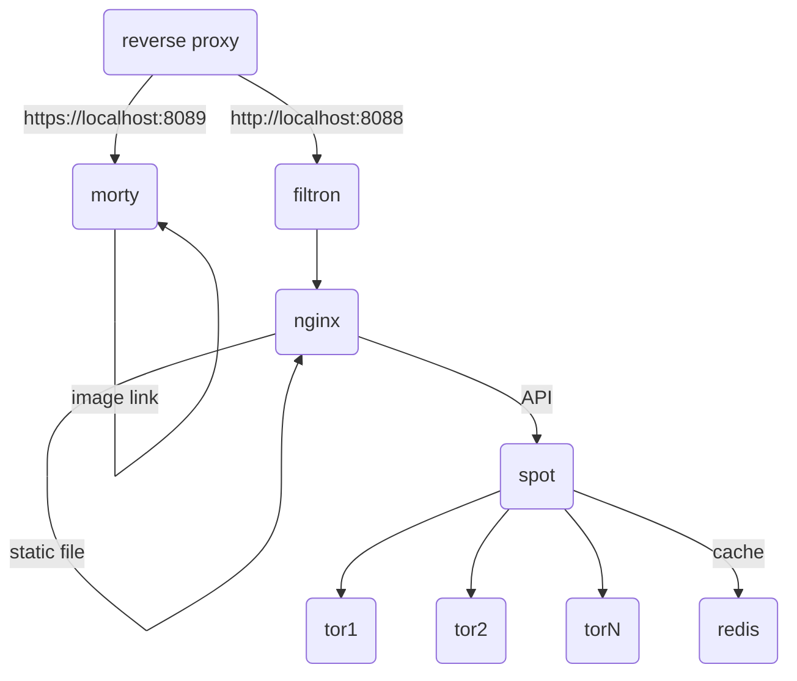

# spot for [/e/](https://e.foundation)


A privacy-respecting, hackable [metasearch engine](https://en.wikipedia.org/wiki/Metasearch_engine).

Spot was forked from searx: read [documentation](https://asciimoo.github.io/searx) and the [wiki](https://github.com/asciimoo/searx/wiki) for more information.

## Changes between Spot and Searx

* eelo theme
* redis cache on http requests (TTL 1 day)
* docker packaging thinking to be production ready

## Architecture

6 services are used for production:

* [filtron](https://github.com/asciimoo/filtron) as reverse HTTP proxy to filter requests by different rules.
* [morty](https://github.com/asciimoo/morty) as proxy to serve thumbnails.
* [nginx](https://www.nginx.com/) as http server to serve static files.
* Spot the meta search engine.
* [tor](https://www.torproject.org) as open network that helps you defend against traffic analysis.
* [redis](https://redis.io/) as memory storage to cache http requests




## Getting Started

You can run spot with docker-compose. First of all you have to install
docker and docker-compose on your host, then follow instructions
below to run spot for production or local environment.

### Like production

* Run the docker-compose up command to start the project 
```
COMPOSE_FILE=docker-compose.yml:docker-compose-build.yml docker-compose up --build morty
SPOT_MORTY_URL=$(docker inspect -f '{{range .NetworkSettings.Networks}}{{.IPAddress}}{{end}}' my-spot_morty_1)
COMPOSE_FILE=docker-compose.yml:docker-compose-build.yml docker-compose up --build spot nginx filtron tor
```

* Getting the ip of the filtron service and go to `http://<ip>`, below the docker way to get the IP of the filtron container
```
docker inspect -f '{{range .NetworkSettings.Networks}}{{.IPAddress}}{{end}}' my-spot_filtron_1
```

### For developer

You can directly run spot, with a python command inside a docker container which
contains all dependencies.

```
docker-compose up -d redis
docker run -it --rm -v $(pwd):/ws -w /ws --network=my-spot_default registry.gitlab.e.foundation:5000/e/cloud/my-spot/env sh
PYTHONPATH=$(pwd) SEARX_REDIS_HOST=redis SEARX_DEBUG=1 python -X dev searx/webapp.py
```

Then, open your browser and navigate to the container IP.
