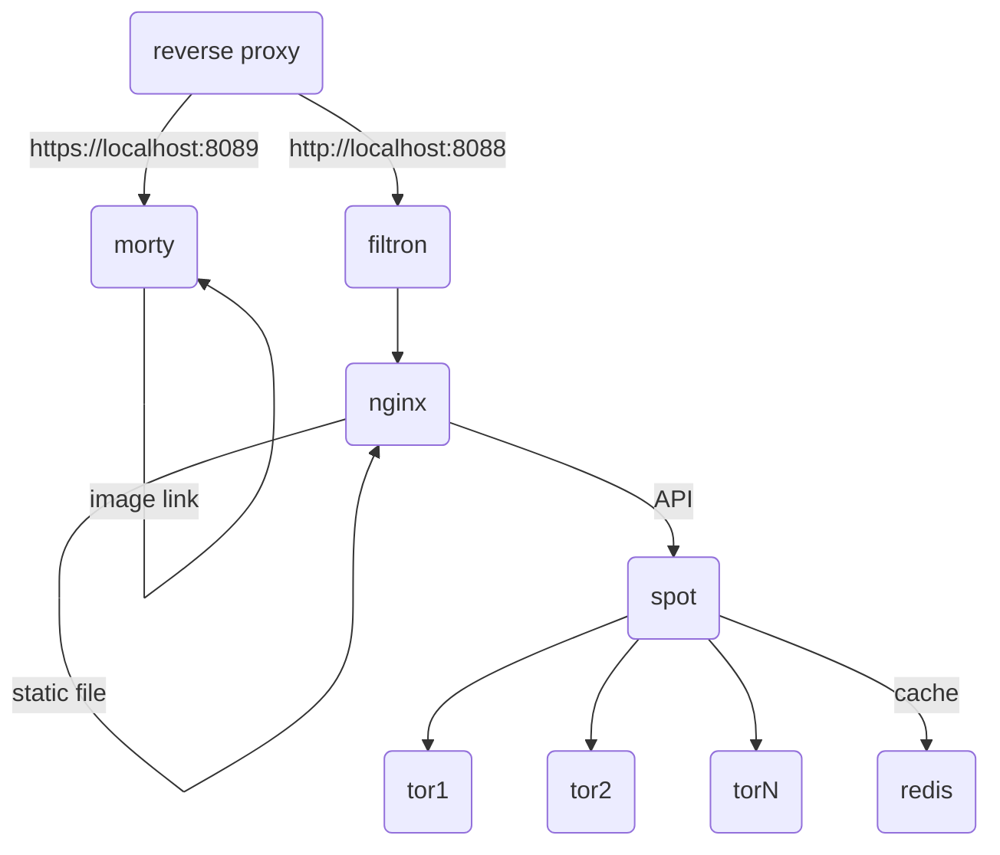

# spot for [/e/](https://e.foundation)


A privacy-respecting, hackable [metasearch engine](https://en.wikipedia.org/wiki/Metasearch_engine).

Spot was forked from searx: read [documentation](https://asciimoo.github.io/searx) and the [wiki](https://github.com/asciimoo/searx/wiki) for more information.

## Changes between Spot and Searx

* eelo theme
* redis cache on http requests (TTL 1 day)
* docker packaging thinking to be production ready

## Architecture

6 services are used for production:

* [filtron](https://github.com/asciimoo/filtron) as reverse HTTP proxy to filter requests by different rules.
* [morty](https://github.com/asciimoo/morty) as proxy to serve thumbnails.
* [nginx](https://www.nginx.com/) as http server to serve static files.
* Spot the meta search engine.
* [tor](https://www.torproject.org) as open network that helps you defend against traffic analysis.
* [redis](https://redis.io/) as memory storage to cache http requests




## Getting Started

You can run spot with docker-compose. First of all you have to install
docker and docker-compose on your host, then follow instructions
below to run spot for production or local environment.

### Like production


update .env file with the path where spot is cloned : 

```
REPO_BASE=/PATH/TO/SPOT/FOLDER
```

Run the docker-compose to start the project

```
docker-compose up -d
```

Then go to http://localhost:8088.

### For developer

You can directly run spot, with a python command inside a docker container which
contains all dependencies. After running the docker-compose stack you can stop
the default spot service and run the debug one with Flask server.

```
docker-compose rm -sf spot
docker run -it --rm -v $(pwd):/ws -w /ws --hostname spot --network=my-spot_default --env-file .env registry.gitlab.e.foundation:5000/e/cloud/my-spot/env bash
PYTHONPATH=$(pwd) SEARX_DEBUG=1 python -X dev searx/webapp.py
```
